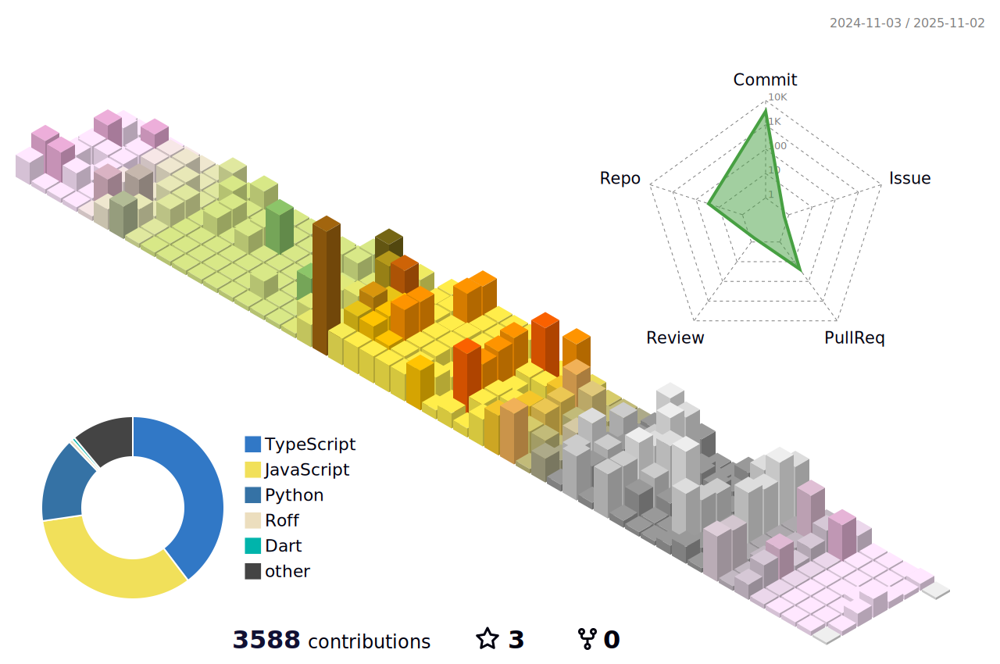

## Career Summary

- **Pairs Trading Bot Development**
  - Developed a trading bot utilizing the Pairs Trading technique for cryptocurrency trading.
  - Implemented strategies to identify and exploit price differentials between related cryptocurrency pairs.

- **KOSPI Fear & Greed Website Development**
  - Created a web application using Python Crawling and Pandas to analyze the KOSPI Fear & Greed index.
  - Scraped relevant data from various sources and processed it using Pandas for insightful analysis.

- **Investment Strategy Analysis based on Brokerage Reports**
  - Conducted a project to evaluate the performance of investment strategies based on brokerage reports.
  - Analyzed the buy recommendations provided by brokerage firms and measured investment returns.

- **NCAV Stock Analysis in the KOSPI Market**
  - Implemented the Net Current Asset Value (NCAV) strategy for analyzing stocks in the KOSPI market.
  - Identified undervalued stocks by comparing their market prices with their NCAV per share.

- **Analysis of Skewness Volatility Phenomenon in High-Volume US Stocks**
  - Investigated the occurrence of Skewness Volatility in high-volume US stocks.
  - Analyzed the relationship between trading volume and stock price fluctuations to understand the phenomenon.

- **Identification of Optimal Timing for Stock Purchases through Price and Volume Analysis**
  - Explored the relationship between stock price and trading volume to identify optimal timing for stock purchases.
  - Conducted quantitative analysis to determine periods with favorable price-volume dynamics for buying stocks.

- **Analysis of Correlation between EPS NTM and Stock Prices**
  - Conducted a correlation analysis between Next Twelve Months (NTM) Earnings Per Share (EPS) and stock prices.
  - Explored the relationship between EPS forecasts and stock price movements to uncover potential investment opportunities.

- **Understanding the Limitations of Combining Financial Data and Machine Learning**
  - Explored the challenges and limitations of integrating financial data with machine learning models.
  - Investigated factors such as data quality, model interpretability, and algorithmic biases.

- **QQQ ETF Price Prediction using Multiple Linear Regression**
  - Developed a predictive model using Multiple Linear Regression to forecast QQQ ETF prices.
  - Utilized historical data and relevant predictors to train the model and make price predictions.

